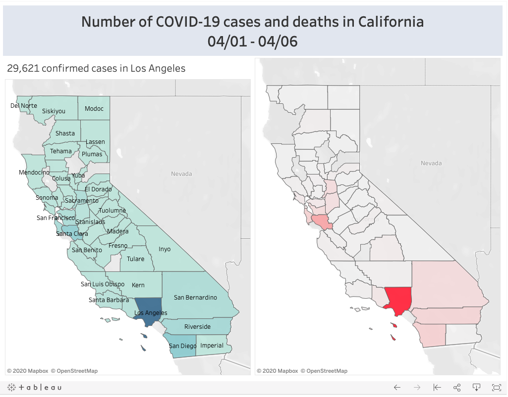

Hello! Welcome to my world of visualizations!  
 
Click on the image to interact with the dashboard. 
 
 

1. Below's visualization is created using the COVID-19 data for counties in California obtained from California Health and Human Services Open Data portal (https://data.chhs.ca.gov/dataset/california-covid-19-hospital-data-and-case-statistics). 
By clicking on the map on the left, the number of confirmed cases within the county will show, and the map on the right will be updated to show the number of COVID-19 positive patients in ICU, and the number of COVID-19 deaths within that selected county. Click outside the map to quit the filter.

2. Here is another visualization to show the total number of COVID-19 cases and total number of COVID-19 deaths worldwide. The bottom right of the dashboard shows the daily number of new COVID-19 cases and daily number of new COVID-19 deaths. You can interact with the dashboard by clicking on any geographical location on the map to filter the charts on the bottom of the dashboard. Click outside of the map to exit the filter.

